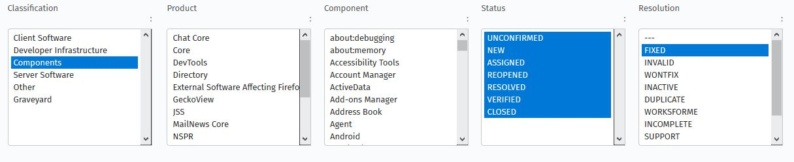
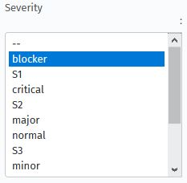
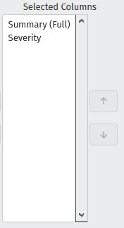

# Project for Seminar: Data Science in for Software Engineering

## Purpose

## Data Fitting
### Retrieving Data
The data was gathered [here](https://bugzilla.mozilla.org/query.cgi?format=advanced) with the following settings:

All the eight categories of severities were set here:

There are eight Types of severites:

1. blocker
2. critical
3. major
4. normal
5. minor
6. trivial
7. enhancement
8. N/A

The following columns were chosen:

The amount of data items found per type* was according to the following table:

| Type | Training | Testing | Found Bugs Total |
| --- | --- | --- | --- |
| blocker | 2000 | 200 | 2332 |
| critical | 2000 | 200 | 10000 |
| major | 2000 | 200 | 10000 |
| normal | 2000 | 200 | 10000 |
| minor | 2000 | 200 | 10000 |
| trivial | 2000 | 200 | 6730 |
| enhancement | 40 | 5 | 45 |
| N/A | 1000 | 200 | 1509 |
| Total | 13045 | 1406 | 50616 |

(* All lists were retrieved on 2020-12-03. List "blocker" was renewed on 2021-01-27)

### Preparing the Data
The data was prepared as follows:
- The severity "enhacement" and N/A were both ignored due to insufficient data.
- Deleting of rows where the data was saved in more than one block (not suitable for input) and replacing them with further lines which were compliant.
- **To-Do:** Bug Ids were deleted (because they are useless)
- .csv files were utf-8 encoded.

**Following an example how the data was fitted:**

`1220011,"Permaorange on beta after merge of Gecko 43: browser_cmd_commands.js | html output for console close - Got Error: Invalid Command: ''., expected","blocker"`

Since there are more than two commas in one line we needed to make sure that there are under any circimstances exactly two commas in each row. Therefore we used the following method:
- We replaced `[Number],"` by a string which will surely not occur in the data, i.e. `^^^^`
- Same procedure for `","`
- We replaced all `,` by a whitespace.
- We replaced all `^^^^` by `,`
- We removed the last `"` at the end of each line.

### Lists 

| Name | Purpose |
| --- | --- |
| training_list.csv | List with data for the training phase of the ML Algorithm. Each severity Type is represented by exactly 2000 examples. |
| testing_list.csv | List with data for the testing phase of the ML Algorithm. Each severity Type is represented by exactly 200 examples. |
| bug_list.csv | List with data for the first test |

## Execution

## Results

## Limitations
